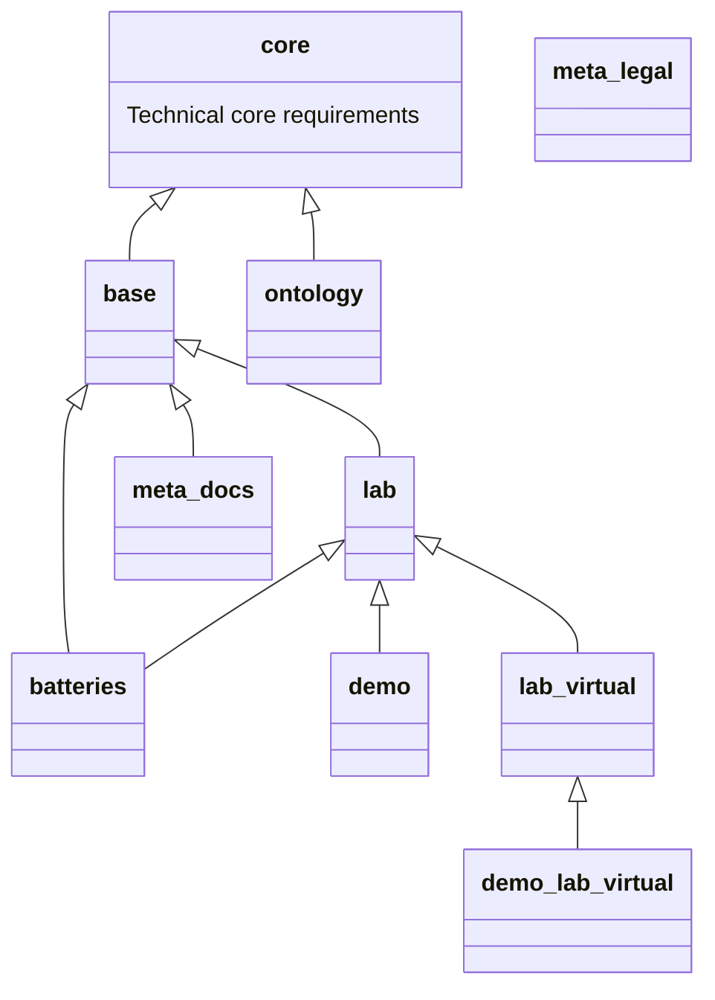

# OpenSemanticWorld-Packages

Data schema and content packages for [OpenSemanticWorld](https://github.com/OpenSemanticWorld) / [OpenSemanticLab](https://github.com/OpenSemanticLab) based on Object-Oriented Linked Data Schema [OO-LD](https://github.com/OO-LD/schema)

## Packages

Until GitHub flavored Markdown allows rendering of Mermaid files directly, the overview graph of available packages is maintained [here](https://github.com/OpenSemanticWorld-Packages/osw-package-maintenance/blob/main/README.md##page-packages).  
