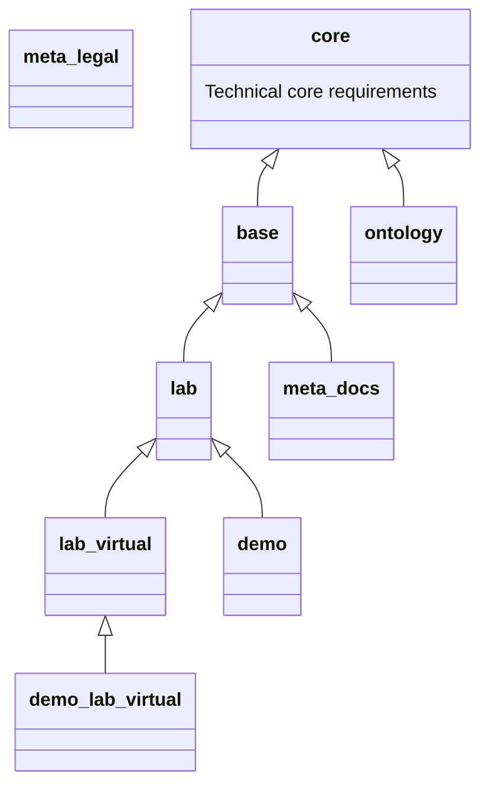

# OpenSemanticWorld-Packages

Data schema and content packages for OpenSemanticWorld / [OpenSemanticLab](https://github.com/OpenSemanticLab)

```mermaid
classDiagram
    class meta_legal
    class core {Technical core requirements}
    link core "https://github.com/OpenSemanticWorld-Packages/world.opensemantic.core" "world.opensemantic.core"
    
    core <|-- base
    core <|-- ontology
    base <|-- lab
    lab <|-- lab_virtual
    base <|-- meta_docs
    lab <|--  demo
    lab_virtual <|--  demo_lab_virtual
```
